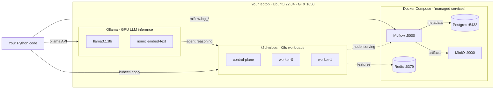

# mlops-journey

[](https://github.com/himanshunigam-456/Mlops-journey/actions/workflows/ci.yml)
[](https://www.python.org/downloads/release/python-3110/)
[](LICENSE)
[](https://github.com/astral-sh/ruff)

A 6-month, project-driven push from DevOps engineering into Senior **MLOps
Platform Engineering with Agentic AI** specialization. Five portfolio projects
spanning fintech, DevOps tooling, healthcare, platform engineering, and
e-commerce — all built local-first on free/OSS tooling.

## Why this repo exists

Most ML engineers know how to train models. Few can productionize them. This
journey closes that gap from the *opposite* direction: I'm a 7-yr DevOps
engineer learning to ship ML, not an ML engineer learning Docker. Every
project leans on the production-engineering moat (K8s, observability, IaC).

## Architecture (local-first dev environment)



**The pattern mirrors production:** managed-services-style infra runs as
docker-compose (mimics RDS / S3 / ElastiCache); workloads run on Kubernetes
(mimics EKS / GKE). Project 4 will *also* deploy the platform itself on K8s
via Helm — the "build your own SageMaker" pattern.

## Projects

| # | Project | Domain | Status |
|---|---------|--------|--------|
| 0 | Warmup — sklearn baseline + MLflow vertical slice | — | 🟡 Week 1 |
| 1 | Self-Healing Credit-Risk Pipeline | Fintech | 📋 Planned |
| 2 | Agentic SRE Co-Pilot (Autonomous Incident Investigator) | DevOps Tooling | 📋 Planned |
| 3 | Medical-Literature RAG with Continuous Evaluation | Healthcare | 📋 Planned |
| 4 | Mini ML Platform on Kubernetes ★ | Platform Engineering | 📋 Planned |
| 5 | Autonomous Pricing & Inventory Agent (Capstone) | E-commerce | 📋 Planned |

★ = portfolio crown jewel.

## Stack (local-first, free)

K3d · Docker Compose · MLflow · MinIO · PostgreSQL · Redis · Ollama (CUDA) ·
LangGraph · Phoenix · Qdrant · Prometheus + Grafana · Terraform · ArgoCD · KServe.

Full "Paid Tool → Free Alternative" mapping in
[`docs/superpowers/specs/`](docs/superpowers/specs/).

## Quick start

```bash
# 1. Copy secrets template (one-time)
cp infra/.env.example infra/.env
# (edit infra/.env with values of your choice)

# 2. Smoke-test all infrastructure
make verify          # expect 18/18 ✅

# 3. Start the local MLOps stack
make up

# 4. Browse services
#    MLflow UI: http://localhost:5000
#    MinIO UI:  http://localhost:9001
```

## Repository layout

```
mlops-journey/
├── .github/workflows/ci.yml            ← lint + tests on every push
├── infra/                              ← local infrastructure
│   ├── docker-compose.yml              ← MLflow + MinIO + Postgres + Redis
│   ├── .env.example                    ← template; copy to .env (gitignored)
│   ├── k3d-create.sh                   ← K8s cluster bootstrap
│   ├── mlflow-entrypoint.sh            ← runtime deps installer
│   ├── hello-world.yaml                ← cluster smoke test
│   └── verify.sh                       ← end-to-end infra check
├── docs/superpowers/specs/             ← design docs + plans
├── project-0-warmup/                   ← Week 1 sklearn refresher
├── project-1-credit-risk-pipeline/     ← Fintech (planned)
├── project-2-sre-copilot/              ← DevOps Tooling (planned)
├── project-3-medical-rag/              ← Healthcare (planned)
├── project-4-ml-platform-k8s/          ← Platform Engineering ★ (planned)
├── project-5-pricing-agent/            ← E-commerce capstone (planned)
└── STATUS.md                           ← current week / blockers
```

## License

MIT — see [LICENSE](LICENSE).

## Author

**Himanshu Nigam** — 7-yr DevOps engineer building production MLOps & agentic AI systems.

---

*Currently executing Week 1 of 26 — see [`STATUS.md`](STATUS.md) for live progress.*
