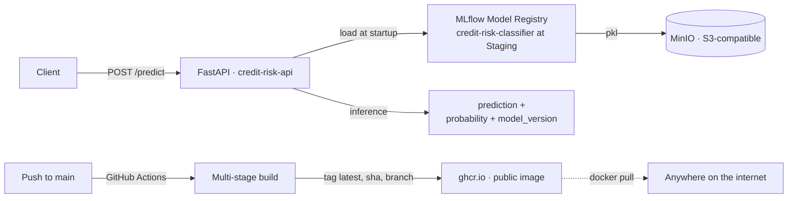
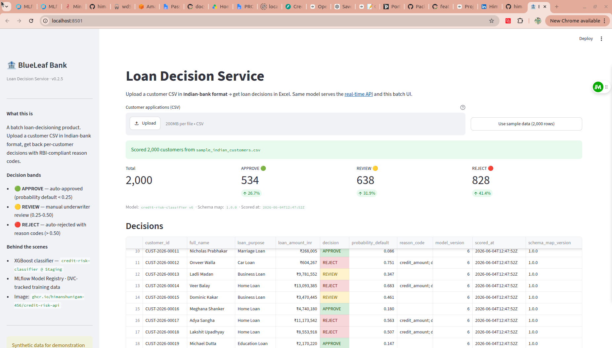
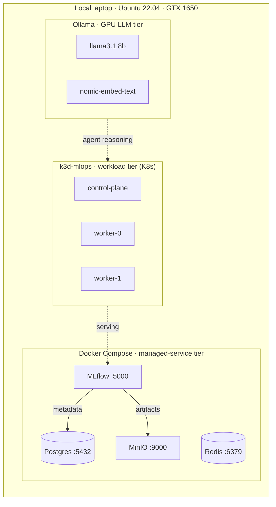

# MLOps Platform Engineering

Production ML infrastructure + agentic AI systems. Built local-first on free OSS tooling — every component is `docker pull`able and reproducible from a fresh laptop.

[](https://github.com/himanshunigam-456/Mlops-journey/actions/workflows/ci.yml)
[](https://github.com/himanshunigam-456/Mlops-journey/pkgs/container/credit-risk-api)
[](https://www.python.org/downloads/release/python-3110/)
[](https://github.com/astral-sh/ruff)
[](LICENSE)

---

## Try it in 30 seconds

```bash
docker run --rm -p 8000:8000 ghcr.io/himanshunigam-456/credit-risk-api:latest
# → http://localhost:8000/docs  (interactive API)
```

That image is the credit-risk classifier described below — built, tested, and continuously published from this repo.

---

## Featured · `credit-risk-api`

Fintech default-prediction service. XGBoost on the UCI German Credit dataset, served behind FastAPI, packaged as a slim multi-stage Docker image, auto-published to GHCR on every push to `main`.

| | |
|---|---|
| **Image** | [`ghcr.io/himanshunigam-456/credit-risk-api:latest`](https://github.com/himanshunigam-456/Mlops-journey/pkgs/container/credit-risk-api) · 1.71 GB · non-root · healthcheck |
| **API surface** | `POST /predict` (Pydantic-validated) · `GET /healthz` · `GET /readyz` |
| **Model lifecycle** | DVC-tracked dataset → XGBoost training sweep → MLflow Registry @ `Staging` → lifespan-loaded into FastAPI |
| **Measured SLA** | p50 **14 ms** · p95 **25 ms** · p99 **35 ms** · 30 RPS sustained · 0 failures across 873 requests |
| **Tests** | 33 / 33 — unit + integration + live-smoke |
| **CI** | GitHub Actions: lint (ruff) + tests + multi-stage Docker build + push to GHCR with layer cache |

### Architecture


```mermaid
flowchart LR
    Client[Client] -->|POST /predict| API[FastAPI · credit-risk-api]
    API -->|load at startup| Registry[MLflow Model Registry<br/>credit-risk-classifier at Staging]
    Registry -->|pkl| Artifact[(MinIO · S3-compatible)]
    API -->|inference| Response[prediction +<br/>probability + model_version]

    GH[Push to main] -->|GitHub Actions| Build[Multi-stage build]
    Build -->|tag latest, sha, branch| GHCR[ghcr.io · public image]
    GHCR -.->|docker pull| Anywhere[Anywhere on the internet]
```

The pattern mirrors production: managed-service infra (MLflow, MinIO, Postgres) runs as docker-compose; workloads run as containers. The trained model artifact lives in object storage and is referenced by Registry alias — version bumps don't require code changes.

### Live demo — batch loan decisioning



A Streamlit UI on top of the same model: upload an Indian-bank-formatted customer CSV (2,000 sample rows included), get back per-customer decisions in three bands — **APPROVE / REVIEW / REJECT** — with feature-importance-based reason codes and an audit trail (model version, schema map version, scored-at timestamp).

```bash
make p2-streamlit          # opens http://localhost:8501
make p2-batch              # CLI: writes loan_decisions.xlsx
make p2-demo-data          # regenerates the 2,000-row synthetic CSV
```

The demo schema mimics what an Indian retail bank's loan-application pipeline emits (PAN, INR amounts, employment categories, Indian addresses). All data is synthetic. The model itself is trained on the open UCI German Credit dataset for reproducibility; a YAML schema map translates between the bank's schema and the model's training schema. Onboarding a new bank's data means editing the YAML, not the code.

---

## Local stack


```mermaid
flowchart LR
    subgraph Host["Local laptop · Ubuntu 22.04 · GTX 1650"]
        subgraph DC["Docker Compose · managed-service tier"]
            MLF[MLflow :5000]
            PG[(Postgres :5432)]
            MIN[MinIO :9000]
            RDS[(Redis :6379)]
            MLF -->|metadata| PG
            MLF -->|artifacts| MIN
        end

        subgraph K3D["k3d-mlops · workload tier (K8s)"]
            CP[control-plane]
            W1[worker-0]
            W2[worker-1]
        end

        subgraph OLL["Ollama · GPU LLM tier"]
            L8[llama3.1:8b]
            NE[nomic-embed-text]
        end

        K3D -.->|serving| MLF
        OLL -.->|agent reasoning| K3D
    end
```

`docker-compose` mimics the cloud-managed tier (RDS / S3 / ElastiCache); `k3d` mimics EKS/GKE. The platform itself will run on K8s via Helm in the roadmap below.

---

## Quick start (run everything locally)

```bash
# 1. Secrets template (one-time)
cp infra/.env.example infra/.env

# 2. Bring up the managed-service tier (MLflow + MinIO + Postgres + Redis)
make up

# 3. Verify (18 health probes)
make verify

# 4. Pull the credit-risk model, train, register
make p1-train && make p1-register

# 5. Serve it via Docker
make p2-docker-build && make p2-docker-run

# 6. Hit the API
curl http://localhost:8000/healthz
open http://localhost:8000/docs
```

---

## Roadmap

| Project | Domain | Focus |
|---|---|---|
| ✅ **credit-risk-api** | Fintech | Tabular ML · serving · Docker · GHCR · load test |
| 🟡 sre-copilot | DevOps tooling | Agentic AI · LangGraph · tool-using assistant for incident response |
| 🟡 medical-rag | Healthcare | RAG with citations · continuous evaluation · drift detection |
| 🟡 ml-platform-on-k8s ★ | Platform engineering | Mini-SageMaker · model serving on K8s · Helm · KServe |
| 🟡 pricing-agent | E-commerce | Multi-step agentic system · natural-language ordering · React/Chainlit UI |

★ = portfolio centerpiece.

The next milestone for `credit-risk-api` is **drift detection + auto-retraining** with Evidently AI, then **canary deployment + Prometheus** monitoring, then **AWS EC2 production demo** with a Streamlit UI.

---

## Stack

**ML / data:** XGBoost · scikit-learn · pandas · DVC · MLflow
**Serving:** FastAPI · Pydantic · uvicorn · Docker · GHCR
**Infra:** Docker Compose · k3d (Kubernetes) · MinIO · PostgreSQL · Redis
**LLM:** Ollama · LangGraph (roadmap) · Phoenix (roadmap)
**Observability:** Locust · Portainer · Prometheus + Grafana (roadmap)
**CI:** GitHub Actions · ruff · pytest · pre-commit · gitleaks

All free / OSS. No paid tools required to reproduce.

---

## See also

- [`CHANGELOG.md`](CHANGELOG.md) — versioned shipped work
- [`project-1-credit-risk-pipeline/README.md`](project-1-credit-risk-pipeline/README.md) — deep-dive on the featured project
- [`docs/superpowers/`](docs/superpowers/) — design specs and implementation plans

---

## Author

**Himanshu Nigam** · DevOps & MLOps Platform Engineering
[LinkedIn](https://www.linkedin.com/in/himanshu-nigam) · **Open to MLOps consulting + senior platform engineering roles**

License: [MIT](LICENSE)
